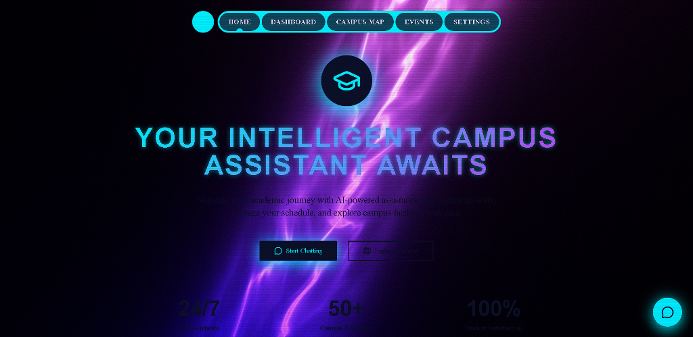
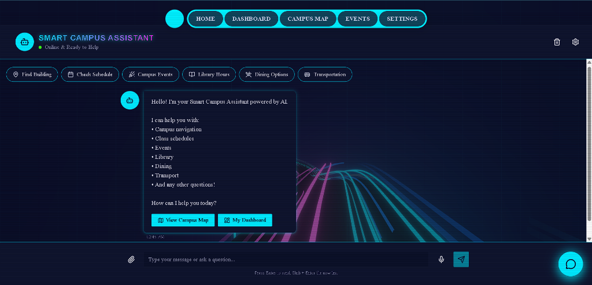
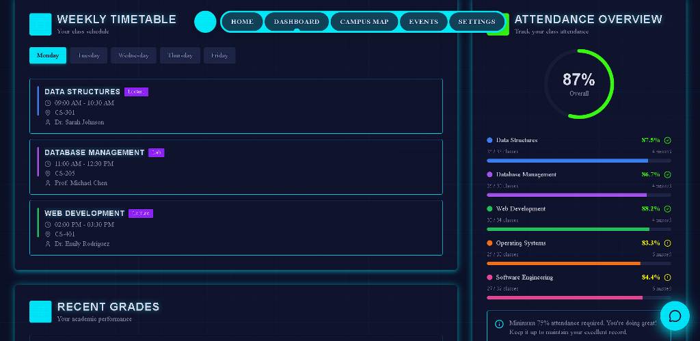
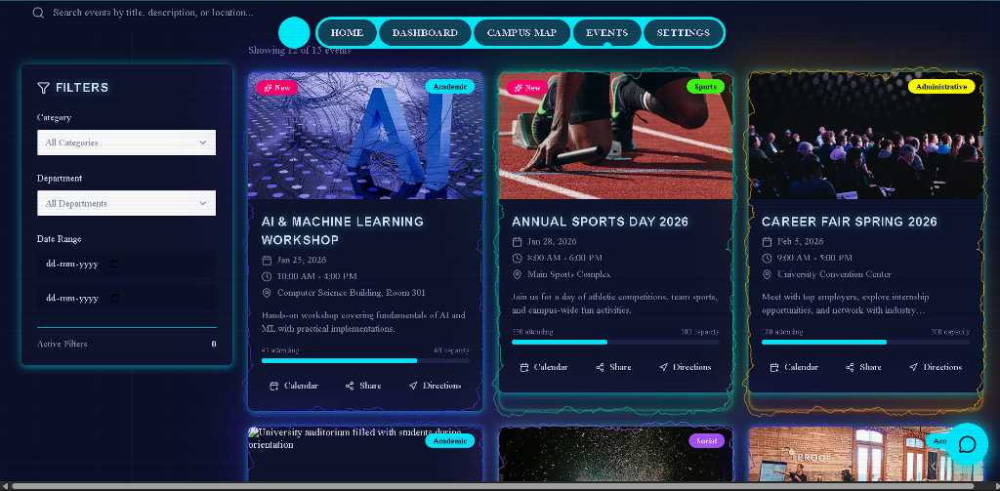
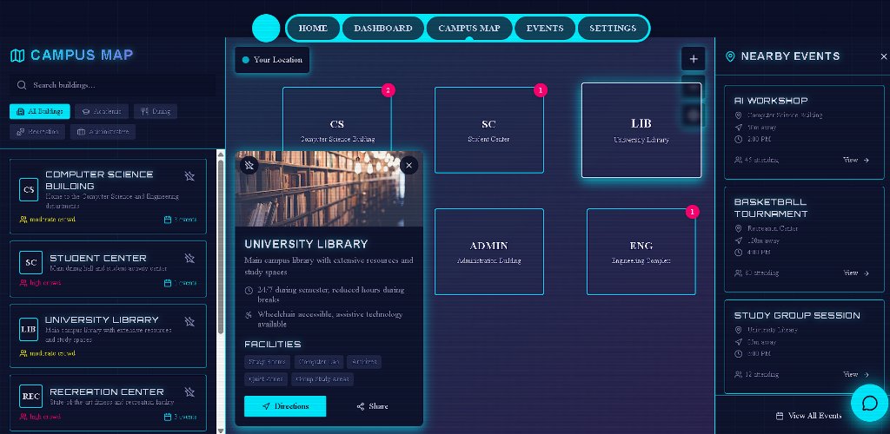

# 🎓 Smart Campus Assistant

An advanced, AI-powered platform designed to enhance the student experience by integrating academic management, campus navigation, and smart assistance into a unified interface.




## 🚀 Features

### 🧠 Smart Assistant

- **AI-Powered Chat**: Integrated with **Google Gemini** and **OpenAI** to provide intelligent responses to student queries.
- **Context Awareness**: Capable of understanding campus-specific context.
- **Voice Interface**: Supports voice interaction for hands-free assistance.

### 📊 Student Dashboard

- **Academic Overview**: Real-time view of attendance, grades, and upcoming assignments.
- **Timetable Management**: Visual weekly schedule with class details.
- **Notifications**: Instant alerts for important notices and deadlines.

### 📅 Events & Notices

- **Campus Updates**: Centralized feed for college events and official notices.
- **Event Details**: comprehensive information pages for specific events.

### 🗺️ Campus Map

- **Interactive Navigation**: Digital map to help students find classrooms, labs, and facilities.

### ⚙️ Settings & Customization
- **Theme Support**: Light/Dark mode and custom color themes.
- **Accessibility**: Configurable accessibility options.

## 🛠️ Tech Stack

### Frontend
- **Framework**: [React 18](https://react.dev/)
- **Build Tool**: [Vite](https://vitejs.dev/)
- **Styling**: [Tailwind CSS](https://tailwindcss.com/) with `tailwindcss-animate`
- **Animation**: [Framer Motion](https://www.framer.com/motion/) & [GSAP](https://greensock.com/gsap/)
- **Routing**: [React Router v6](https://reactrouter.com/)
- **Icons**: [Lucide React](https://lucide.dev/)
- **3D/Graphics**: Three.js & OGL

### Backend
- **Server**: Node.js & Express
- **AI Integration**: Google Generative AI SDK & OpenAI SDK

## 📁 Project Structure

```bash
casestd/
├── server/                 # Backend Node.js/Express server
│   ├── index.js            # Server entry point
│   └── package.json        # Backend dependencies
├── src/
│   ├── components/         # Reusable UI components (ui/, shared/)
│   ├── pages/              # Main application pages
│   │   ├── home/           # Landing page
│   │   ├── student-dashboard/ # Student analytics & tools
│   │   ├── smart-assistant/   # AI chat interface
│   │   ├── events/            # Events listing
│   │   └── settings/          # User preferences
│   ├── services/           # API services (geminiService, openaiService)
│   ├── styles/             # Global styles & Tailwind
│   ├── App.jsx             # Root component
│   └── Routes.jsx          # Route definitions
├── public/                 # Static assets
└── tailwind.config.js      # Tailwind configuration
```

## ⚡ Getting Started

### Prerequisites
- Node.js (v16+)
- npm or yarn

### 1. Frontend Setup
```bash
# Install dependencies
npm install

# Start development server
npm run dev
```

### 2. Backend Setup
The backend handles AI API requests and other server-side logic.
```bash
cd server

# Install dependencies
npm install

# Start the server
npm start
```

### 3. Environment Variables
Create a `.env` file in the root directory (or server directory as needed) and add your API keys:

```env
# Example keys (replace with actuals)
VITE_GOOGLE_API_KEY=your_gemini_api_key
VITE_OPENAI_API_KEY=your_openai_api_key
```

## 🎨 Design System
The project uses a modern design system built on Tailwind CSS with custom utility classes for:
- **Glassmorphism**: `.glass` utilities for frosted glass effects.
- **Animations**: `transition-smooth` for consistent interactions.
- **Colors**: Semantic color variables (primary, secondary, accent) defined in CSS.

## 🤝 Contributing
1. Fork the repository
2. Create your feature branch (`git checkout -b feature/AmazingFeature`)
3. Commit your changes (`git commit -m 'Add some AmazingFeature'`)
4. Push to the branch (`git push origin feature/AmazingFeature`)
5. Open a Pull Request
